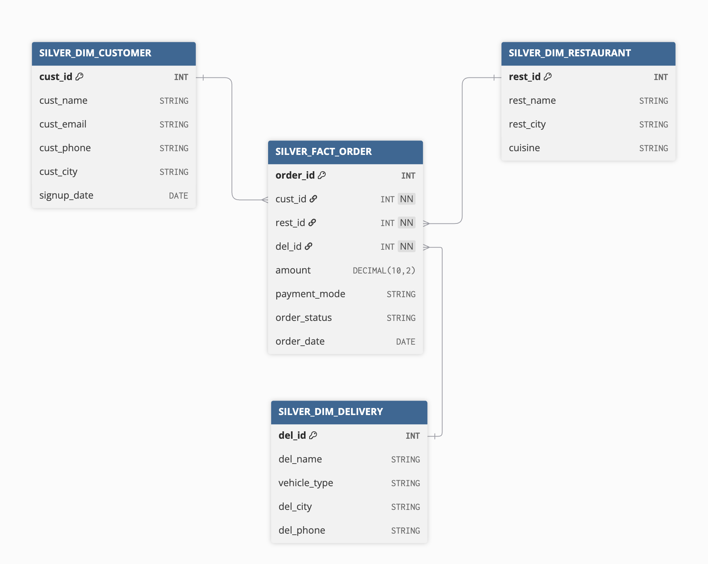

# 🍽️ Zomato Data Pipeline Project

This project implements a multi-layered data architecture in Snowflake using the Medallion Architecture Bronze–Silver–Gold layers. The data is ingested from raw CSV into Snowflake, transformed into a star schema (Silver layer), and finally exposed as secure curated views (Gold layer) for analytics and BI consumption.

## 🥉 Bronze Layer (Raw Data)

* Contains ingested CSV data (zomato_master_data.csv).
* Stored in BRONZE_ZOMATO_BASE table.
* Structure matches source file: customer, restaurant, delivery, payment, and order details.
* No transformations applied.

## 🥈 Silver Layer (Star Schema)

Implements a star schema with:

* DIM_CUSTOMER
* DIM_RESTAURANT
* DIM_DELIVERY
* FACT_ORDER

Fact table links to surrogate keys in dimensions.

## 🥇 Gold Layer (Curated Analytics)

Exposes business KPIs via SECURE VIEWS only. Protects against query plan leakage and enforces least privilege.

KPIs implemented:

* Total Revenue (GMV)
* Total Orders
* Average Order Value (AOV)
* Order Status Distribution
* Payment Mode
* Revenue & Order Distribution by Cuisine
* Top Restaurants by Revenue (with ranking)
* Cancel Rate by Delivery Agent
* New Customers per Month
* High Order Frequency Customers (% with ≥5 orders)
* Customer Lifetime Value (CLV, masked for privacy)